> ***DDC - Data Driven Content object*** - enables you to display your data in a custom third-party visualization within your SAS Visual Analytics report. 

>***The third-party visualization*** for a data-driven content object can be authored in any JavaScript charting framework, such as D3.js, Google Charts, and CanvasJS. 

This project will guide you to find and use DDC object and pre-written functions for sending and receiving data from SAS VA.

The steps for creating the report:
* Create a local folder with the name of the project. This folder will contain all the JavaScript code, images, APIs and necessary files:


* Give the folder a name:
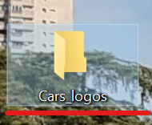

* To write the code and also temporary use *Live Server* utility we will use the **Visual Studio Code** application:
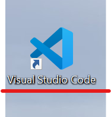

* Launch the application, click **File** icon and choose **Open Folder**:
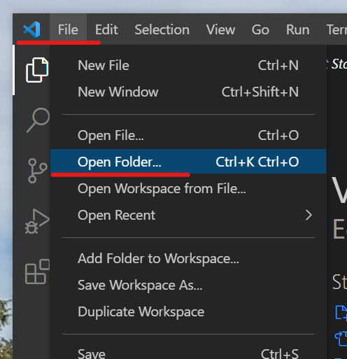

* On your computer navigate to the location of the project folder:
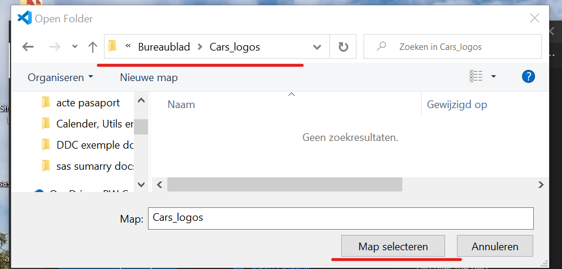

* In your current directory create 3 new folders *images*, *thirdPartyHelpers* and *util*
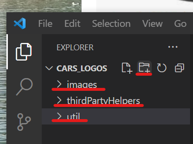

* In the images folder save all the photos that you are going to use in your report. (I named the images with the exact names like in the data set.)
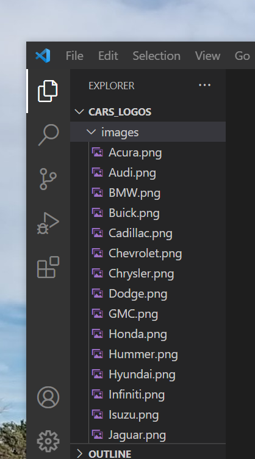

* To get the content for *thirdPartyHelpers* and *util* folders click the link below:
    * **util** - contains the functions you need to validate the data received from VA
    * **thirdPartyHelpers** - contains functions you most likely need with Google Charts
    [https://github.com/sassoftware/sas-visualanalytics-thirdpartyvisualizations]()
    **NOTE:** *For this example we will only use code from the util function.*
    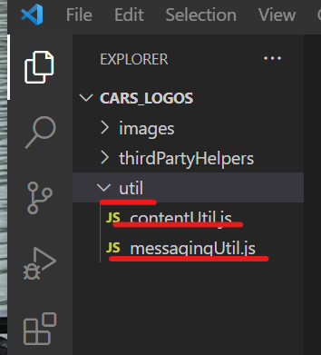

* To write the actual code and to build the appearence of your web page we need to create a html file. Click **new file** icon, give the file a **name** with **html** extension:
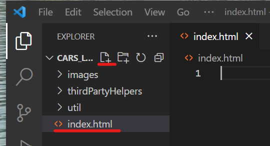

* In the file press **Shift** + **!** and then **Enter** to generate the boilerplate of the index.html file:
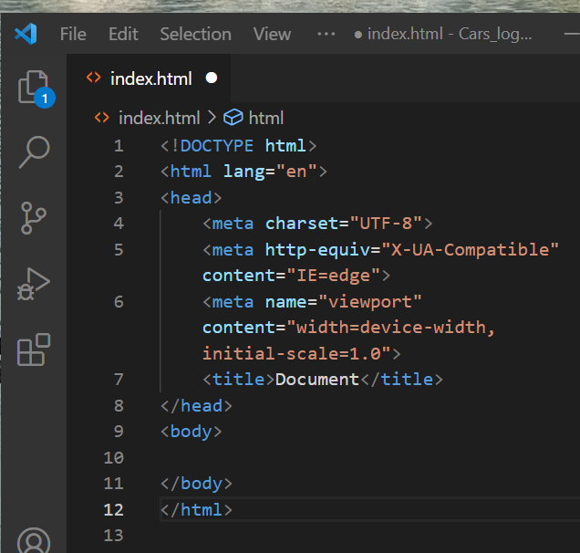

* Because we use sAS API we have to include this comment with copyrights in the **head** tag:
```
<!--
Copyright 2018 SAS Institute Inc.
Licensed under the Apache License, Version 2.0 (the "License");
you may not use this file except in compliance with the License.
You may obtain a copy of the License at
    https://www.apache.org/licenses/LICENSE-2.0
Unless required by applicable law or agreed to in writing, software
distributed under the License is distributed on an "AS IS" BASIS,
WITHOUT WARRANTIES OR CONDITIONS OF ANY KIND, either express or implied.
See the License for the specific language governing permissions and
limitations under the License.
-->
```

* In the **head** section Add a name for your web page between **title** tag.Then add first **script** tag that point to *util* folder and *messagingUtil.js* file:

    * It contains the functions you need to send/receive messages to/from SAS Visual Analytics.
    **NOTE:** This code is already written and ready to be integrated and used. More information about all the options you can access this git repository:
    [https://github.com/sassoftware/sas-visualanalytics-thirdpartyvisualizations]()

* To give style for the elements displayed on your page you can add some CSS code in a **style** tag:
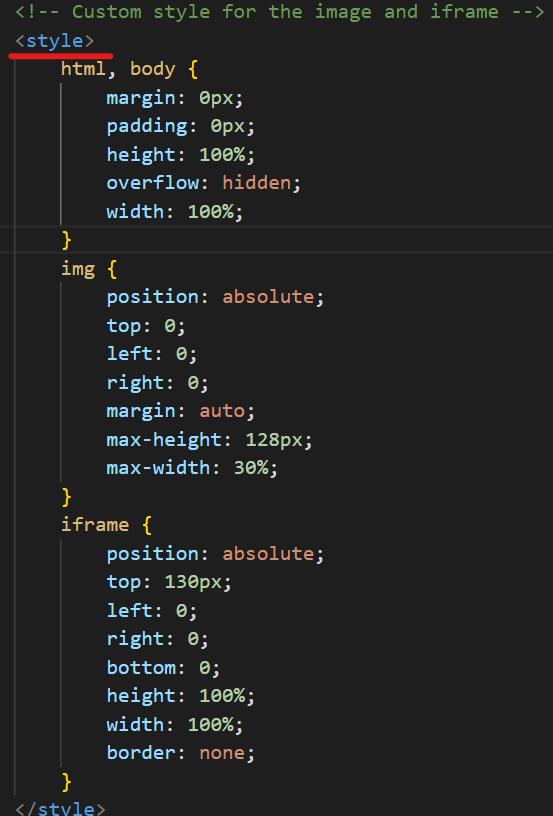
    **NOTE:** How to write CSS, HTML and JavaScript is not a goal of this project. For documentation you can access this links:
    [https://developer.mozilla.org/en-US/docs/Web/CSS](), [https://developer.mozilla.org/en-US/docs/Web/HTML](), [https://developer.mozilla.org/en-US/docs/Web/JavaScript]()

* In your **body** section, we need to create a "container" that will hold all the embedded elements. For this project we will use a **image** that is used as a **link**.We will have also an **iframe** element that will display the response information (*ex: Wikipedia page*):
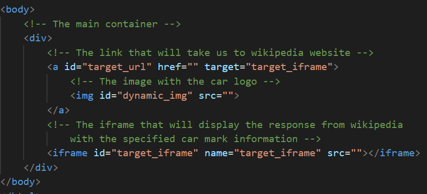

* We will now add the javaScript code in a **script** tag. First we will use va object method **setOnDataReceivedCallback** to set a callback function that will handle messages received from VA.
`va.messagingUtil.setOnDataReceivedCallback(callback)`
The callback function must be defined by us.
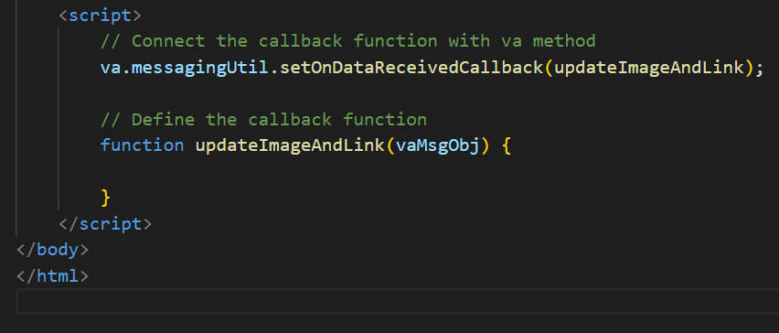

* The code in our function will:
    1) Display in console the va object and va data
    2) Ckeck if the data is received and the connection is made. 
    If *true*:   
        * Select the image and dynamically change the source with a chosen value from va data
        * Select the anchor element and give it the url to the wikipedia page of the car mark showed in the image
    If *false*:
        * Clean the source and url of the link and the image tag


**Note:** The JavaScript content for your third-party visualizations must be stored on a web server. 

* For now we will use a Visual Studio Code feature called *Live Server*. This will make a connection to your local server and make it possible to connect to your VA report.
To open the local server **right click** on your html page and then **Open with Live Server** :
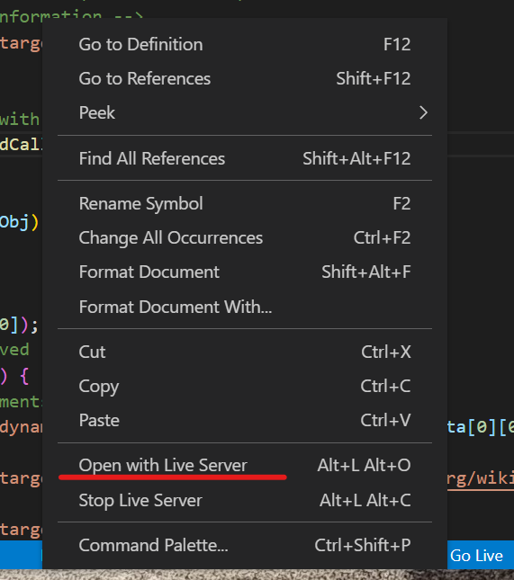
    * This will automatically open a new tab in your local browser. The page at this moment will be empty:
    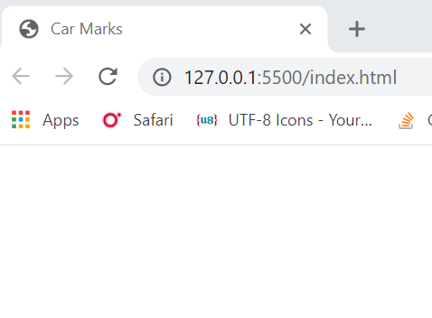

**NOTE:** To get the actual data from VA we need to create a new report in Visual Analytics

---

<!-- code for va -->
* Login to your sas environment using your personal **login** and **password**:
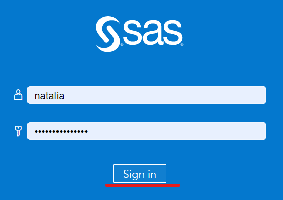

* Go to menu icon and choose **Explore and Visualize**, that is Visual Analytics application:
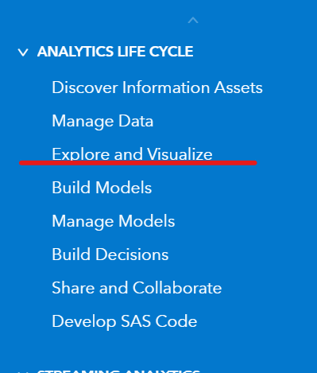

* In this case I will import a local xlsx file with data about cars:
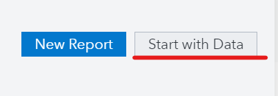

* In my case I will click **Import** and **Local files**
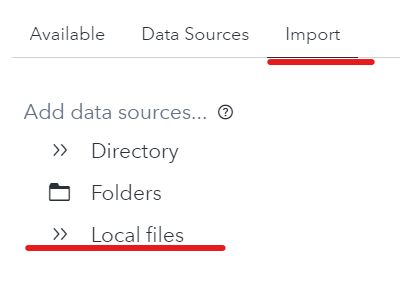

* Navigate to the file location, select the file and click **Open**


* First give the target table a **name**, choose **Replace file** if the target table already exist, if your file contains the name columns select **First row contains column names** and then click **Import Item**
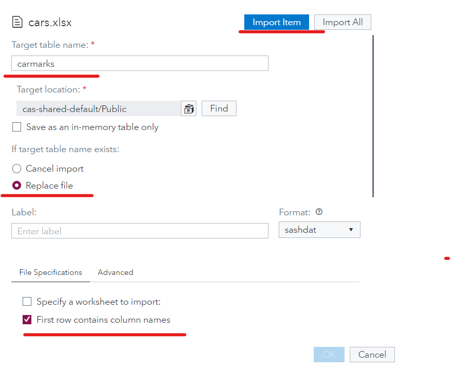

* If the import run successfully you get a green colored message and the table is ready to use, click then **OK**


* Data now is ready for use:


* Click on **Objects** icon and from there choose **Precision container** object:
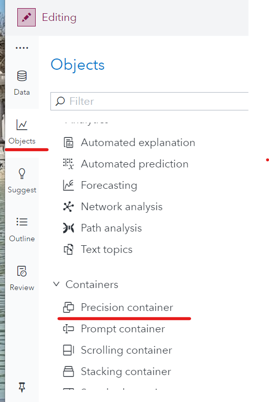

* Click en drag it to the work area. Now, from the **Objects** tab select a **Drop-down** object:
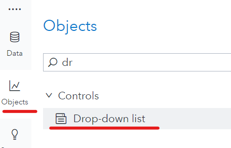

* Click en drag it to the precision container and select a place to keep (*top-left corner*):
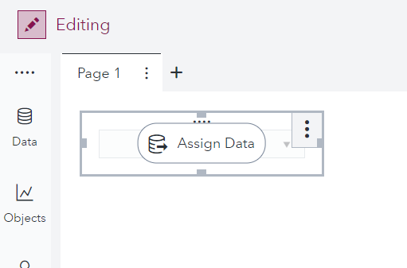

* Click **Assign data**, for Category, click **Add** and select the **Make** variable and then click **Close**
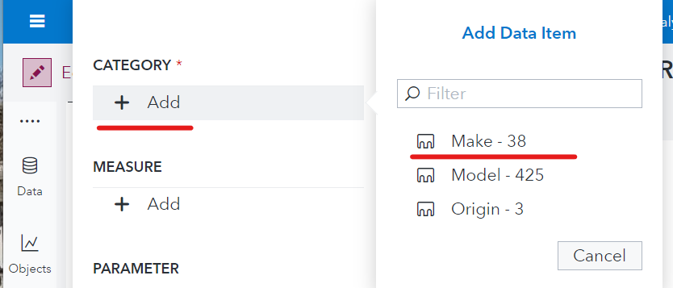

* Click on **Objects** icon and from there choose **Data-driven content** object:


* Click en drag it to the precision container and select a place to keep and click **Assign Data**:


* In **Variables** field select **Make** variable and the **OK** and **Close**
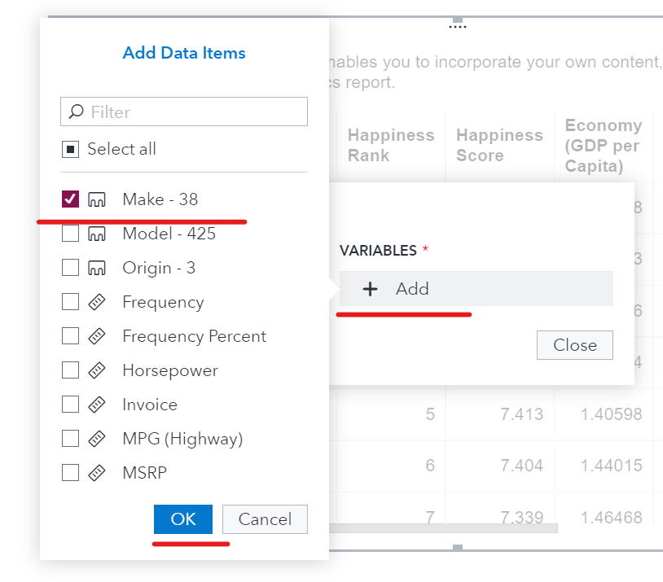

* To embed our web page in the current report:
    * Copy the address on which your local server runs the web page
    * Click **Options** and scroll until you see **Web Content**
    * In **URL** field insert your own address 
    * Minimize *Options* tab


* At this moment you get a picture with car logo, when the logo is clicked, a wikipedia page is loaded to the report:


* To make it interactive add a action between the drop-down list and DDC object:
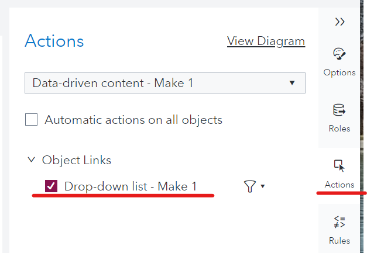

* To check that the data and analize the code, we can inspect the report web page:
    * Press **Ctrl**+**Shift**+**I** or right click  and choose **Inspect** and see the data and other details about the object:
   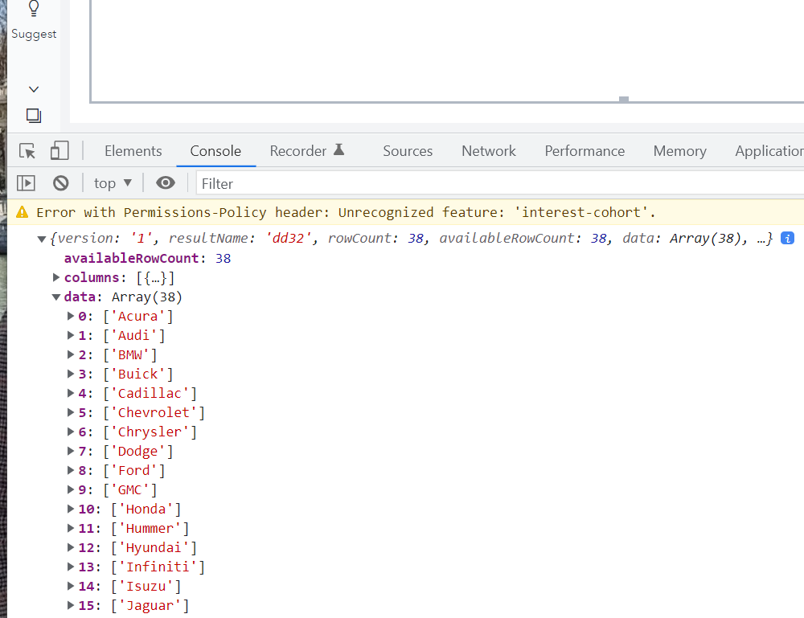 

* Now we can save he project, give it a proper name and choose a location:
    * Press **Save** icon, add a **Name**, location and then click **Save**

--- 
If you want you can add and link different objects. Also you can deploy your code for avoiding starting every time the local server.

In this exemple I will add a **List table** object with car's models and the price and two **Key value** objects with the price and the horse power.

The final code will be accessible in this repository:
[https://github.com/nataliaermurachi/carmarks_exemple]()

> Useful resources:
* [https://communities.sas.com/t5/SAS-Communities-Library/Embedding-Dynamic-Web-Pages-and-Images-in-SAS-Visual-Analytics/ta-p/763738]()
* [https://documentation.sas.com/doc/en/vacdc/8.2/varef/n109mqtyl6quiun1mwfgtcn2s68b.htm#n1ua0gttqu1mibn16o9itypr5ai2]()
* [https://github.com/sassoftware/sas-visualanalytics-thirdpartyvisualizations]()
* [https://github.com/sassoftware/sas-visualanalytics-thirdpartyvisualizations/tree/master/samples/DynamicWebPagesAndImages]()
* [https://github.com/sassoftware/sas-visualanalytics-thirdpartyvisualizations/blob/master/samples/DynamicWebPagesAndImages/ddc_DynamicImageWithLink.html]()
